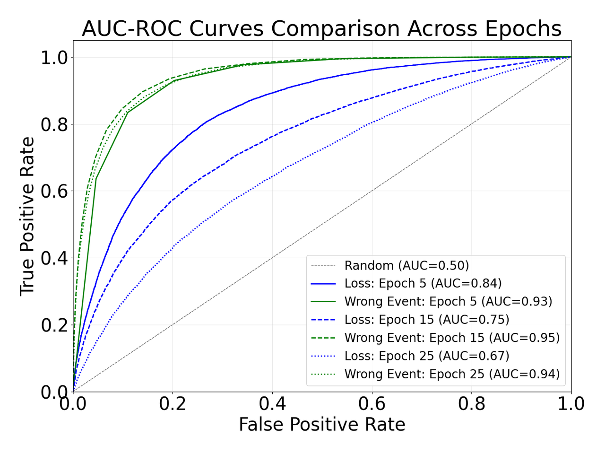

## 📊 Figures and Tables

### Table 1

<table border="1" cellspacing="0" cellpadding="5">
  <thead>
    <tr>
      <th rowspan="2">Noise</th>
      <th colspan="3">Sym. 60%</th>
      <th colspan="3">Asym. 40%</th>
      <th colspan="3">Inst. 40%</th>
    </tr>
  </thead>
  <tbody>
    <tr>
      <td>Epoch</td>
      <td>20</td>
      <td>60</td>
      <td>100</td>
      <td>20</td>
      <td>60</td>
      <td>100</td>
      <td>20</td>
      <td>60</td>
      <td>100</td>
    </tr>
    <tr>
      <td>Loss</td>
      <td>0.95</td>
      <td>0.80</td>
      <td>0.63</td>
      <td>0.80</td>
      <td>0.64</td>
      <td>0.58</td>
      <td>0.84</td>
      <td>0.65</td>
      <td>0.59</td>
    </tr>
    <tr>
      <td>Wrong Event</td>
      <td>0.96</td>
      <td>0.98</td>
      <td>0.97</td>
      <td>0.94</td>
      <td>0.94</td>
      <td>0.92</td>
      <td>0.94</td>
      <td>0.95</td>
      <td>0.94</td>
    </tr>
  </tbody>
</table>

Table 1. The AUC values Loss and Wrong Event. The experiment is conducted under the setting with ResNet18 on CIFAR-10 under three noise settings, with AdamW, lr = 1e-3, weight_decay = 1e-5, batch_size=64. The experiment was performed on a single A100 80GB, repeated 5 times

### Figure 1

			
    
	
    
     		
    Figure 1. The results of Loss, Wrong Event and Random. The experiment is conducted under the setting with ResNet-18 on CIFAR-10 with Inst. 40%, with AdamW, lr = 1e-3, weight_decay = 1e-5, batch_size=64. The experiment was performed on a single A100 80GB.
    

### Table 2

<table border="1" cellspacing="0" cellpadding="5">
  <thead>
    <tr>
      <th>Method</th>
      <th>Accuracy(%)</th>
      <th>Per Epoch Time(s)</th>
      <th>Per Epoch BMM Time(s)</th>
    </tr>
  </thead>
  <tbody>
    <tr>
      <td>IDO(BMM)</td>
      <td>83.6</td>
      <td>121</td>
      <td>4.6</td>
    </tr>
  </tbody>
</table>

Table 2. The results of IDO(BMM). The experiment is conducted under the setting with ResNet50 on CIFAR-100 with Inst. 40% noise, with AdamW, lr = 1e-3, weight_decay = 1e-5, batch_size=64. The experiment was performed on a single A100 80GB, repeated 5 times

### Table 3

<table border="1" cellspacing="0" cellpadding="5">
  <thead>
    <tr>
      <th>Method</th>
      <th>Accuracy(%)</th>
      <th>Per Epoch Time(s)</th>
      <th>Per Epoch Fitting Time(s)</th>
    </tr>
  </thead>
  <tbody>
    <tr>
      <td>M-Correction(BMM)</td>
      <td>78.9</td>
      <td>399</td>
      <td>14.7</td>
    </tr>
    <tr>
      <td>DivideMix(GMM)</td>
      <td>81.3</td>
      <td>457</td>
      <td>19.5</td>
    </tr>
    <tr>
      <td>IDO(BMM)</td>
      <td>83.6</td>
      <td>121</td>
      <td>4.6</td>
    </tr>
  </tbody>
</table>

Table 3. The results of M-Correction(BMM), DivideMix(GMM), IDO(BMM). The experiment is conducted under the setting with ResNet50 on CIFAR-100 with Inst. 40% noise, with AdamW, lr = 1e-3, weight_decay = 1e-5, batch_size=64. The experiment was performed on a single A100 80GB, repeated 5 times
