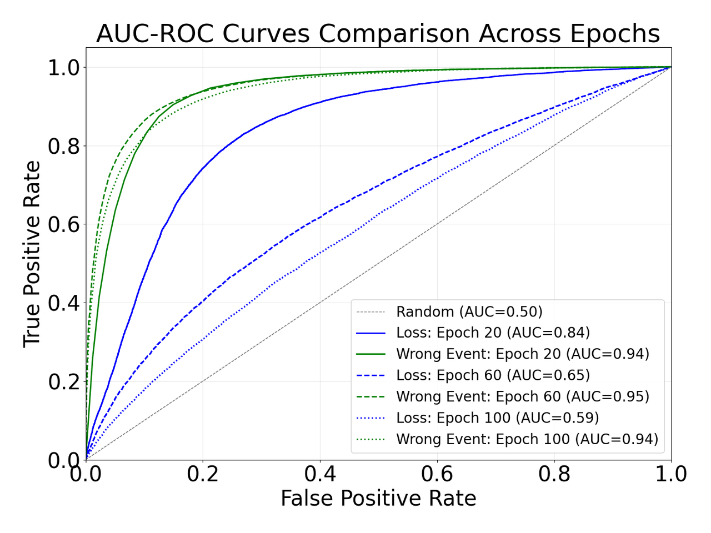

## 📊 Figures and Tables

### Table 1

<table border="1" cellspacing="0" cellpadding="5">
  <thead>
    <tr>
      <th rowspan="2">Noise</th>
      <th colspan="3">Sym. 60%</th>
      <th colspan="3">Asym. 40%</th>
      <th colspan="3">Inst. 40%</th>
    </tr>
  </thead>
  <tbody>
    <tr>
      <td>Epoch</td>
      <td>20</td>
      <td>60</td>
      <td>100</td>
      <td>20</td>
      <td>60</td>
      <td>100</td>
      <td>20</td>
      <td>60</td>
      <td>100</td>
    </tr>
    <tr>
      <td>Loss</td>
      <td>0.95</td>
      <td>0.80</td>
      <td>0.63</td>
      <td>0.80</td>
      <td>0.64</td>
      <td>0.58</td>
      <td>0.84</td>
      <td>0.65</td>
      <td>0.59</td>
    </tr>
    <tr>
      <td>Wrong Event</td>
      <td>0.96</td>
      <td>0.98</td>
      <td>0.97</td>
      <td>0.94</td>
      <td>0.94</td>
      <td>0.92</td>
      <td>0.94</td>
      <td>0.95</td>
      <td>0.94</td>
    </tr>
  </tbody>
</table>

Table 1. The AUC values of Loss and Wrong Event. The experiment is conducted with ResNet18 on CIFAR10 under Sym. 60%, Asym. 40%, Inst. 40%. We use the metric AUC which comprehensively considered accuracy, precision and recall, to measure the selecting ability of selective metrics at different thresholds. The larger the AUC, the stronger the classification ability of the metric. It is conducted with SGD, lr = 1e-2, weight_decay = 5e-4, batch_size=128. The experiment was performed on a single A100 80GB, repeated 5 times.

### Table 2

<table border="1" cellspacing="0" cellpadding="5">
  <thead>
    <tr>
      <th rowspan="2">Noise</th>
      <th colspan="3">Sym. 60%</th>
      <th colspan="3">Asym. 40%</th>
      <th colspan="3">Inst. 40%</th>
    </tr>
  </thead>
  <tbody>
    <tr>
      <td>Epoch</td>
      <td>20</td>
      <td>60</td>
      <td>100</td>
      <td>20</td>
      <td>60</td>
      <td>100</td>
      <td>20</td>
      <td>60</td>
      <td>100</td>
    </tr>
    <tr>
      <td>Loss</td>
      <td>0.85</td>
      <td>0.69</td>
      <td>0.60</td>
      <td>0.62</td>
      <td>0.56</td>
      <td>0.55</td>
      <td>0.79</td>
      <td>0.61</td>
      <td>0.59</td>
    </tr>
    <tr>
      <td>Wrong Event</td>
      <td>0.87</td>
      <td>0.92</td>
      <td>0.91</td>
      <td>0.72</td>
      <td>0.75</td>
      <td>0.74</td>
      <td>0.86</td>
      <td>0.88</td>
      <td>0.88</td>
    </tr>
  </tbody>
</table>

Table 2. The AUC values of Loss and Wrong Event. The experiment is conducted with ResNet18 on CIFAR100 under Sym. 60%, Asym. 40%, Inst. 40%. We use the metric AUC which comprehensively considered accuracy, precision and recall, to measure the selecting ability of selective metrics at different thresholds. The larger the AUC, the stronger the classification ability of the metric. It is conducted with SGD, lr = 1e-2, weight_decay = 5e-4, batch_size=128. The experiment was performed on a single A100 80GB, repeated 5 times.

### Figure 1

			
    
	
    
     		
    Figure 1. The AUC-ROC curves of loss and wrong event at early, midterm, later training stages, i.e., 20 epochs, 60 epochs, 100 epochs. The experiment is conducted under the setting with ResNet18 on CIFAR-10 Inst. 40% noise.The AUC-ROC (Area Under the Receiver Operating Characteristic Curve) metric evaluates the classifier's ability to distinguish between classes. A higher AUC value indicates better classification performance, as it balances the trade-off between true positive rate (recall) and false positive rate across various thresholds. The experiment is conducted with SGD, lr = 1e-2, weight_decay = 5e-4, batch_size=128.
    

