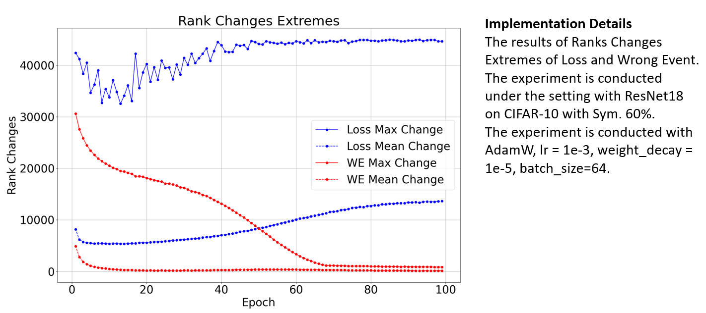

## 📊 Figures and Tables

### Figure 1

			
    
	
    
     		
    

### Table 1

<table border="1" cellspacing="0" cellpadding="5">
  <thead>
    <tr>
      <th rowspan="2">Noise</th>
      <th colspan="3">Sym. 60%</th>
      <th colspan="3">Asym. 40%</th>
      <th colspan="3">Inst. 40%</th>
      <th rowspan="4">Implementation Details</th>
    </tr>
  </thead>
  <tbody>
    <tr>
      <td>Epoch</td>
      <td>5</td>
      <td>15</td>
      <td>25</td>
      <td>5</td>
      <td>15</td>
      <td>25</td>
      <td>5</td>
      <td>15</td>
      <td>25</td>
      <td rowspan="4">
        The AUC values of Loss and Wrong Event.  
        The experiment is conducted under the setting with pre-trained ResNet50 on CIFAR-100 under three noise settings.   
        The experiment is conducted with SGD, lr = 1e-2, weight_decay = 5e-4, batch_size=128. 
      </td>
    </tr>
    <tr>
      <td>Loss</td>
      <td>0.96</td>
      <td>0.88</td>
      <td>0.74</td>
      <td>0.66</td>
      <td>0.63</td>
      <td>0.59</td>
      <td>0.84</td>
      <td>0.77</td>
      <td>0.68</td>
    </tr>
    <tr>
      <td>Wrong Event</td>
      <td>0.97</td>
      <td>0.98</td>
      <td>0.98</td>
      <td>0.76</td>
      <td>0.80</td>
      <td>0.79</td>
      <td>0.92</td>
      <td>0.95</td>
      <td>0.94</td>
    </tr>
  </tbody>
</table>

### Figure 2

			
    
	
    
     		
    

### Table 2

<table border="1" cellspacing="0" cellpadding="5">
  <thead>
    <tr>
      <th>Noise</th>
      <th>Sym. 60%</th>
      <th>Asym. 40%</th>
      <th>Inst. 40%</th>
      <th rowspan="5">Implementation Details</th>
    </tr>
  </thead>
  <tbody>
    <tr>
      <td>Single Loss + BMM</td>
      <td>75.3</td>
      <td>69.7</td>
      <td>68.4</td>
      <td rowspan="4">
        The results of single loss, accumulated loss and wrong event  
        with GMM and BMM. The experiment is conducted under the  
          setting with ResNet-18 on CIFAR-10 with  
          Sym. 60%, Asym. 40%, Inst. 40% noise, with  
          AdamW, lr = 1e-3, weight_decay = 1e-5, batch_size=64.
      </td>
    </tr>
    <tr>
      <td>Accumulated Loss + GMM</td>
      <td>79.2</td>
      <td>74.5</td>
      <td>75.9</td>
    </tr>
    <tr>
      <td>Accumulated Loss + BMM</td>
      <td>80.1</td>
      <td>75.9</td>
      <td>77.1</td>
    </tr>
    <tr>
      <td>Wrong event + BMM</td>
      <td><b>80.8</b></td>
      <td><b>78.0</b></td>
      <td><b>82.9</b></td>
    </tr>
  </tbody>
</table>

### Table 3

<table border="1" cellspacing="0" cellpadding="5">
  <thead>
    <tr>
      <th>Start Model</th>
      <th>Sym. 60%</th>
      <th>Asym. 40%</th>
      <th>Inst. 40%</th>
      <th rowspan="3">Implementation Details</th>
    </tr>
  </thead>
  <tbody>
    <tr>
      <td>Initial Model</td>
      <td>80.1</td>
      <td>77.1</td>
      <td>83.3</td>
      <td rowspan="2">
        The results of Initial Model and Base Model.  
        The experiment is conducted under the setting  
          with ResNet-50 on CIFAR-100 with Sym. 60%,  
          Asym. 40%, Inst. 40% noise, with AdamW, lr = 1e-3,  
          weight_decay = 1e-5, batch_size=64.
      </td>
    </tr>
    <tr>
      <td>Base Model</td>
      <td><b>81.3</b></td>
      <td><b>77.6</b></td>
      <td><b>83.8</b></td>
    </tr>
  </tbody>
</table>

### Table 4

<table border="1" cellspacing="0" cellpadding="5">
  <thead>
    <tr>
      <th>$$\epsilon(\cdot)$$</th>
      <th>Sym. 60%</th>
      <th>Asym. 40%</th>
      <th>Inst. 40%</th>
      <th rowspan="4">Implementation Details</th>
    </tr>
  </thead>
  <tbody>
    <tr>
      <td>Without $$\epsilon(\cdot)$$ = 0</td>
      <td>78.2</td>
      <td>70.4</td>
      <td>77.3</td>
      <td rowspan="3">
        The results of weighting term $$\epsilon(\cdot)$$ for loss $$\mathcal{L_{SIM}}$$.   
          The experiment is conducted under the setting  
          with Pretrained ResNet-50 on CIFAR-100 with  
          Sym. 60%, Asym. 40%, Inst. 40% noise, with  
          AdamW, lr = 1e-3, weight_decay = 1e-5, batch_size=64.
      </td>
    </tr>
    <tr>
      <td>Fixed $$\epsilon(\cdot)$$ = 1</td>
      <td>80.3</td>
      <td>76.8</td>
      <td>82.8</td>
    </tr>
    <tr>
      <td>Dynamic $$\epsilon(\cdot)$$</td>
      <td><b>81.1</b></td>
      <td><b>77.5</b></td>
      <td><b>83.7</b></td>
    </tr>
  </tbody>
</table>

### Table 5

<table border="1" cellspacing="0" cellpadding="5">
  <thead>
    <tr>
      <th>Noise</th>
      <th>Sym. 60%</th>
      <th>Asym. 40%</th>
      <th>Inst. 40%</th>
      <th rowspan="5">Implementation Details</th>
    </tr>
  </thead>
  <tbody>
    <tr>
      <td>Loss + Total BMM</td>
      <td>79.9</td>
      <td>69.9</td>
      <td>74.6</td>
      <td rowspan="4">
        The results of loss and wrong event with Total Class BMM.  
        The experiment is conducted under the setting with Pretrained  
        ResNet-50 on CIFAR-100 with Sym. 60%, Asym. 40%, Inst. 40% noise, 
          with AdamW, lr = 1e-3, weight_decay = 1e-5, batch_size=64.
      </td>
    </tr>
    <tr>
      <td>Loss + Class BMM</td>
      <td>80.8</td>
      <td>76.0</td>
      <td>79.8</td>
    </tr>
    <tr>
      <td>Wrong event + Total BMM</td>
      <td>80.3</td>
      <td>75.7</td>
      <td>81.5</td>
    </tr>
    <tr>
      <td>Wrong event + Class BMM</td>
      <td><b>81.2</b></td>
      <td><b>78.3</b></td>
      <td><b>83.2</b></td>
    </tr>
  </tbody>
</table>

