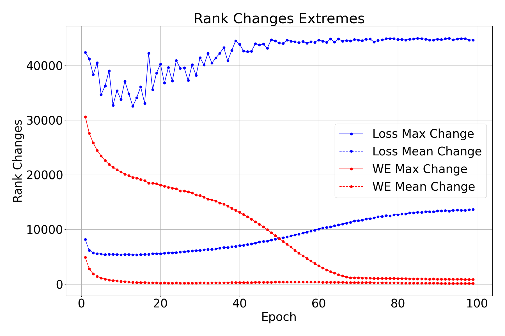
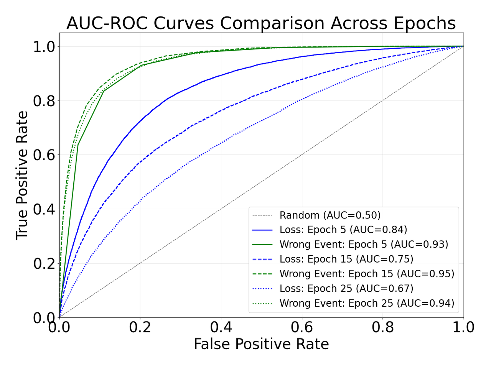

## 📊 Figures and Tables

### Figure 1

Figure 1. The results of Ranks Changes Extremes of Loss and Wrong Event. The experiment is conducted under the setting with ResNet18 on CIFAR-10 with Sym. 60%. The rank changes of loss and WE reflect significant fluctuations, especially due to hard samples, while weight changes become more stable over time as training progresses. By sorting samples based on metrics, we can better understand how loss and WE evolve, avoiding unfair comparisons due to numerical size differences. The experiment is conducted with AdamW, lr = 1e-3, weight_decay = 1e-5, batch_size=64. 

### Table 1

<table border="1" cellspacing="0" cellpadding="5">
  <thead>
    <tr>
      <th rowspan="2">Noise</th>
      <th colspan="3">Sym. 60%</th>
      <th colspan="3">Asym. 40%</th>
      <th colspan="3">Inst. 40%</th>
    </tr>
  </thead>
  <tbody>
    <tr>
      <td>Epoch</td>
      <td>5</td>
      <td>15</td>
      <td>25</td>
      <td>5</td>
      <td>15</td>
      <td>25</td>
      <td>5</td>
      <td>15</td>
      <td>25</td>
    </tr>
    <tr>
      <td>Loss</td>
      <td>0.96</td>
      <td>0.88</td>
      <td>0.74</td>
      <td>0.66</td>
      <td>0.63</td>
      <td>0.59</td>
      <td>0.84</td>
      <td>0.77</td>
      <td>0.68</td>
    </tr>
    <tr>
      <td>Wrong Event</td>
      <td>0.97</td>
      <td>0.98</td>
      <td>0.98</td>
      <td>0.76</td>
      <td>0.80</td>
      <td>0.79</td>
      <td>0.92</td>
      <td>0.95</td>
      <td>0.94</td>
    </tr>
  </tbody>
</table>

Table 1. The AUC values of Loss and Wrong Event. The experiment is conducted under the setting with pre-trained ResNet50 on CIFAR-100 under three noise settings. We use the metric AUC which comprehensively considered accuracy, precision and recall, to measure the selecting ability of selective metrics at different thresholds. The larger the AUC, the stronger the classification ability of the metric. The experiment is conducted with AdamW, lr = 1e-3, weight_decay = 1e-5, batch_size=64. 

### Figure 2

Figure 2. The AUC-ROC curves of loss and wrong event at early, midterm, later training stages, i.e., 20 epochs, 60 epochs, 100 epochs. The experiment is conducted under the setting with pretrained ResNet18 on CIFAR-10 Inst. 40% noise.The AUC-ROC (Area Under the Receiver Operating Characteristic Curve) metric evaluates the classifier's ability to distinguish between classes. A higher AUC value indicates better classification performance, as it balances the trade-off between true positive rate (recall) and false positive rate across various thresholds. The experiment is conducted with SGD, lr = 1e-2, weight_decay = 5e-4, batch_size=128. 

### Table 2

| Noise                  | Sym. 60% | Asym. 40% | Inst. 40% |
| ---------------------- | -------- | --------- | --------- |
| Single Loss + BMM      | 75.3     | 69.7      | 68.4      |
| Accumulated Loss + GMM | 79.2     | 74.5      | 75.9      |
| Accumulated Loss + BMM | 80.1     | 75.9      | 77.1      |
| Wrong event + BMM      | **80.8**     | **78.0**      | **82.9**      |

Table2. The results of single loss, accumulated loss and wrong event with GMM and BMM. The experiment is conducted under the setting with ResNet-18 on CIFAR-10 with Sym. 60% Asym. 40% Inst. 40% noise, with AdamW, lr = 1e-3, weight_decay = 1e-5, batch_size=64. 

### Table 3

| Start Model   | Sym. 60% | Asym. 40% | Inst. 40% |
| ------------- | -------- | --------- | --------- |
| Initial Model | 80.1     | 77.1      | 83.3      |
| Base Model    | **81.3**     | **77.6**      | **83.8**      |

Table3. The results of Initial Model and Base Model. The experiment is conducted under the setting with ResNet-50 on CIFAR-100 with Sym. 60% Asym. 40% Inst. 40% noise, with AdamW, lr = 1e-3, weight_decay = 1e-5, batch_size=64. 

### Table 4

| $$\epsilon(\cdot)$$          | Sym. 60% | Asym. 40% | Inst. 40% |
| ---------------------------- | -------- | --------- | --------- |
| Without $$\epsilon(\cdot)$$ =0 | 78.2     | 70.4      | 77.3      |
| Fixed $$\epsilon(\cdot)$$ =1   | 80.3     | 76.8      | 82.8      |
| Dynamic $$\epsilon(\cdot)$$   | **81.1**     | **77.5**      | **83.7**      |

Table4. The results of weighting term $$\epsilon(\cdot)$$ for loss $$\mathcal{L_{SIM}}$$. The experiment is conducted under the setting with Pretrained ResNet-50 on CIFAR-100 with Sym. 60% Asym. 40% Inst. 40% noise, with AdamW, lr = 1e-3, weight_decay = 1e-5, batch_size=64. 

### Table 5

| Noise                   | Sym. 60% | Asym. 40% | Inst. 40% |
| ----------------------- | -------- | --------- | --------- |
| Loss + Total BMM        | 79.9     | 69.9      | 74.6      |
| Loss + Class BMM        | 80.8     | 76.0      | 79.8      |
| Wrong event + Total BMM | 80.3     | 75.7      | 81.5      |
| Wrong event + Class BMM | **81.2**     | **78.3**      | **83.2**      |

Table5. The results of loss and wrong event with Total BMM and Class BMM. The experiment is conducted under the setting with Pretrained ResNet-50 on CIFAR-100 with Sym. 60% Asym. 40% Inst. 40% noise, with AdamW, lr = 1e-3, weight_decay = 1e-5, batch_size=64. 

